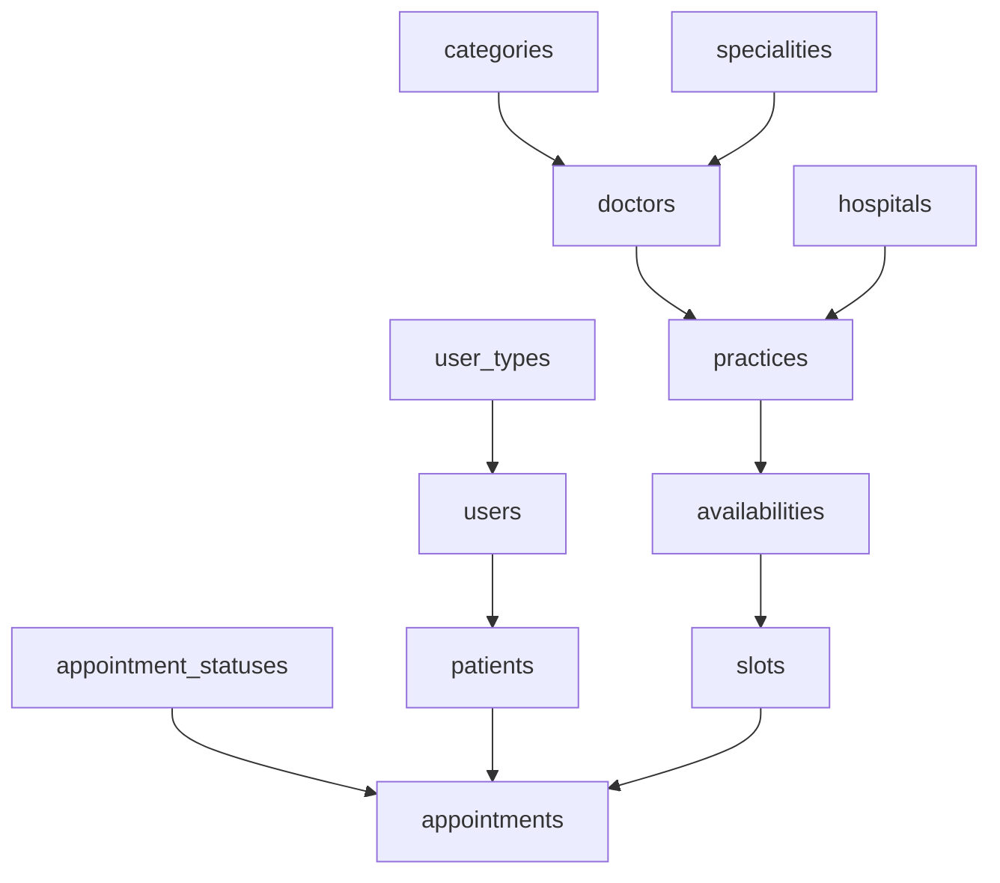

# Database Seeder Commands
> Version: 1.0.0
> Last Updated: 2024-02-13

This document outlines all available seeder commands for managing test data in the database.

## Quick Start

```bash
# Seed all data (cleans existing data first)
npm run seed

# Clean all data without seeding
npm run seed:clean

# Clean specific model data
npm run seed:clean:model users

# Seed specific model (with dependencies)
npm run seed:one users
```

## Available Seeders

| Seeder Name | Description | Dependencies | Sample Data |
|-------------|-------------|--------------|-------------|
| `user_types` | Basic user types | None | patient, doctor, agent, admin |
| `appointment_statuses` | Appointment status codes | None | IN_PROCESS, SCHEDULED, CANCELLED, etc. |
| `categories` | Medical categories | None | Mental Health, General Medicine, Surgery |
| `specialities` | Doctor specialities | None | Psychologist, Psychiatrist, etc. |
| `hospitals` | Hospital records | None | 8 random hospitals |
| `doctors` | Doctor profiles | categories, specialities | 22 doctors (70% mental health) |
| `users` | Users and patients | None | 8 agents, 1 admin, 320 patients |
| `practices` | Doctor practices | doctors, hospitals | 1-2 practices per doctor |
| `availabilities` | Doctor availability | practices | Mon/Wed/Fri slots |
| `slots` | Appointment slots | practices, availabilities | 7 days of slots |
| `appointments` | Appointments | slots, patients | ~35% of slots booked |

## Detailed Usage

### 1. Full Database Reset
```bash
# Clean and reseed everything
npm run seed

# This is equivalent to:
npm run seed:clean   # Clean all data
npm run seed:one appointments  # Seed everything (due to dependencies)
```

### 2. Cleaning Data
```bash
# Clean all data
npm run seed:clean

# Clean specific model
npm run seed:clean:model users
npm run seed:clean:model doctors
npm run seed:clean:model appointments
```

### 3. Seeding Individual Models
```bash
# Basic data
npm run seed:one user_types
npm run seed:one categories
npm run seed:one specialities

# Users and doctors
npm run seed:one doctors  # Also seeds categories & specialities
npm run seed:one users    # Creates agents, admin, and patients

# Scheduling
npm run seed:one practices        # Also seeds doctors & dependencies
npm run seed:one availabilities   # Also seeds practices & dependencies
npm run seed:one slots           # Also seeds availabilities & dependencies

# Appointments
npm run seed:one appointments    # Seeds everything due to dependencies
```

### 4. Data Relationships

The seeders maintain referential integrity by automatically handling dependencies:



## Test Data Characteristics

1. **Users**:
   - All users have password: `Password123!`
   - Admin email: `admin@example.com`
   - 8 agent users (random emails)
   - 320 patient users

2. **Doctors**:
   - 22 total doctors
   - 70% are mental health specialists
   - Each has 1-2 practice locations

3. **Scheduling**:
   - Availability on Mon/Wed/Fri
   - 10:00 AM to 2:00 PM slots
   - 30-minute duration
   - 7 days of future slots

4. **Appointments**:
   - ~35% of slots are booked
   - Mix of statuses (scheduled, completed, cancelled)
   - Realistic fee range (1500-6000 PKR)

## Best Practices

1. **Order of Operations**:
   - Always clean before seeding to avoid duplicates
   - Use the most specific command for your needs
   - Let the dependency system handle prerequisites

2. **Development Workflow**:
   ```bash
   # Starting fresh
   npm run seed

   # Updating specific data
   npm run seed:clean:model appointments
   npm run seed:one appointments

   # Quick reset
   npm run seed:clean
   ```

3. **Common Scenarios**:
   - Testing new features: Seed only related models
   - Full testing: Use `npm run seed`
   - Data cleanup: Use `npm run seed:clean`

## Troubleshooting

If you encounter issues:

1. **Dependency Errors**:
   - Use `npm run seed:clean` to reset everything
   - Then seed from scratch with `npm run seed`

2. **Duplicate Data**:
   - Always clean before seeding
   - Check if multiple seeders are running

3. **Missing Data**:
   - Ensure you're using the right seeder
   - Check if dependencies were cleaned accidentally

## Contributing

When adding new seeders:

1. Add the seeder to `prisma/seed/` using snake_case naming:
   ```
   prisma/seed/
   ├── user_types.seed.ts
   ├── appointment_statuses.seed.ts
   ├── categories.seed.ts
   └── ...
   ```

2. Update the seeder name in `SEEDER_NAMES` (also using snake_case)
3. Add the model mapping in `MODEL_MAP`
4. Update this documentation
5. Test the full seed cycle 